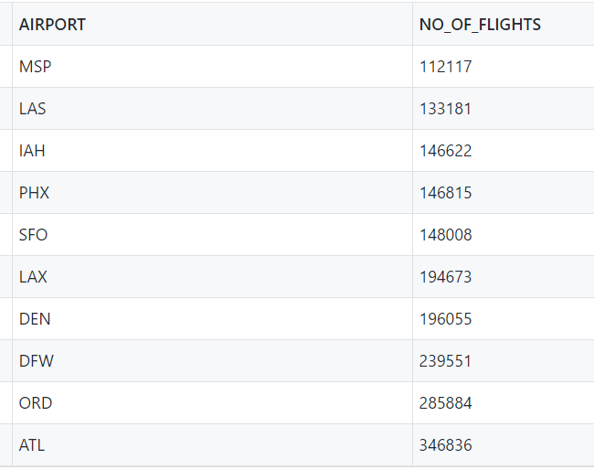
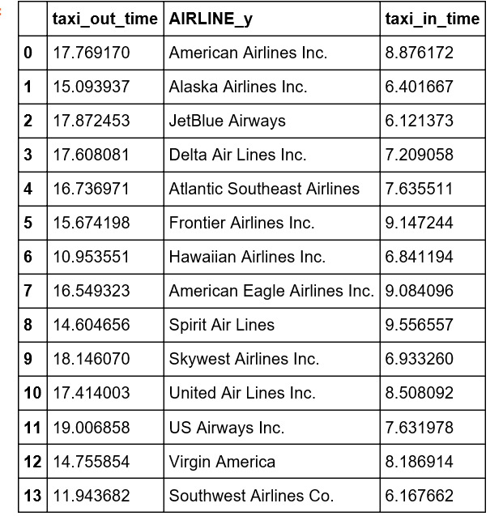
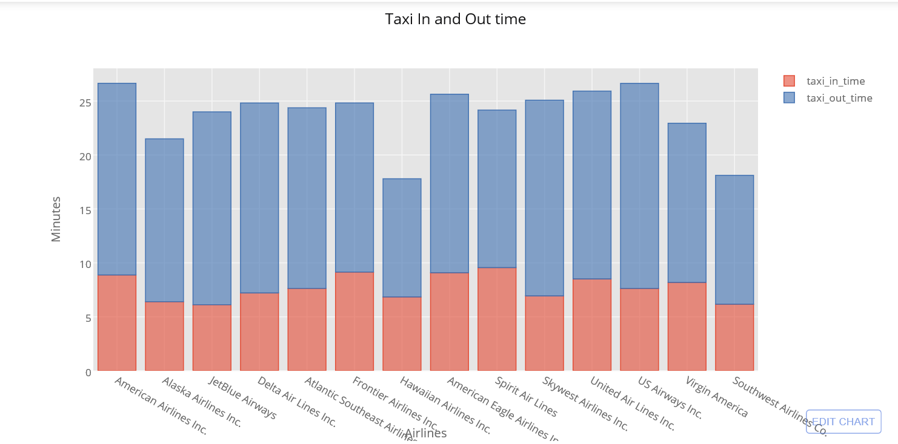

#  Data Analysis Using Python(INFO 7374) - Final Project

## Data Analysis for flight records of year 2015

Flight Data

 * Click <a href="Data">here</a> to view the data downloaded.
 * Files are segregated based on location of airport, shortforms of Airlines' name and Flights data.
 * Files are stored in csv format.
 * Files are scalaed down because the original files were more than 650 mbs in size so just a sneak is given
    

## Analysis 1

### The analysis for the most busiest day of the week and most busiest month of the year is done.

## Outputs

Plot Files: <a href="Part1/Part1png">Part 1 plots</a>

## Number of Departures per Week plot

## Flights per month plot

## Analysis 2

### To find out and plot Airports with most Departing Flights and Arriving Flights

## Outputs

CSV Files: <a href="Part2/part2CSVs">here</a>

Plot Files: <a href="Part2/part2PNG">here </a>
## Most Departure Flights Traffic at Airports - Top 10 

### The graph has a hover function which specify the details if you pull the repository and run it.

## Most Arrival Flights Traffic at US airports

## Analysis 3

### To find Effect of delays over different Months and to find the share of different Airlines in the delays occurred.

## Outputs

CSV Files:  <a href="Part3/part3CSVs">here</a>

Plot Files: <a href="Part3/Part3PNG">here</a>

### The graphs have a hover function which specify the details if you pull the repository and run it.

## Effect of delays over Months

## Share of different Airlines in the delays

## Analysis 4

### Airports with max number of Cancelled flights and Airports with max number of delayed Flights.

## Outputs

CSV Files:   <a href="Part4/part4CSVs">here</a>

Plot Files:  <a href="Part4/Part4PNG">here</a>

##  Airports with max number of Cancelled flights

## Airports with max number of delayed Flights

## Analysis 5

## Have an insight in Taxi in and out time for different airlines
### Taxi-Out Time: The time elapsed between departure from the origin airport gate and wheels off.
### Taxi-In Time: The time elapsed between wheels-on and gate arrival at the destination airport.

## Speed of Different Airlines

## Airports present around USA

## Outputs

Plot Files:  <a href="part5/part5PNG">here</a>

### The graphs have a hover function which specify the details if you pull the repository and run it.

##  Taxi in and out time for different airlines

## Speed of Different Airlines

## Airports present around USA

